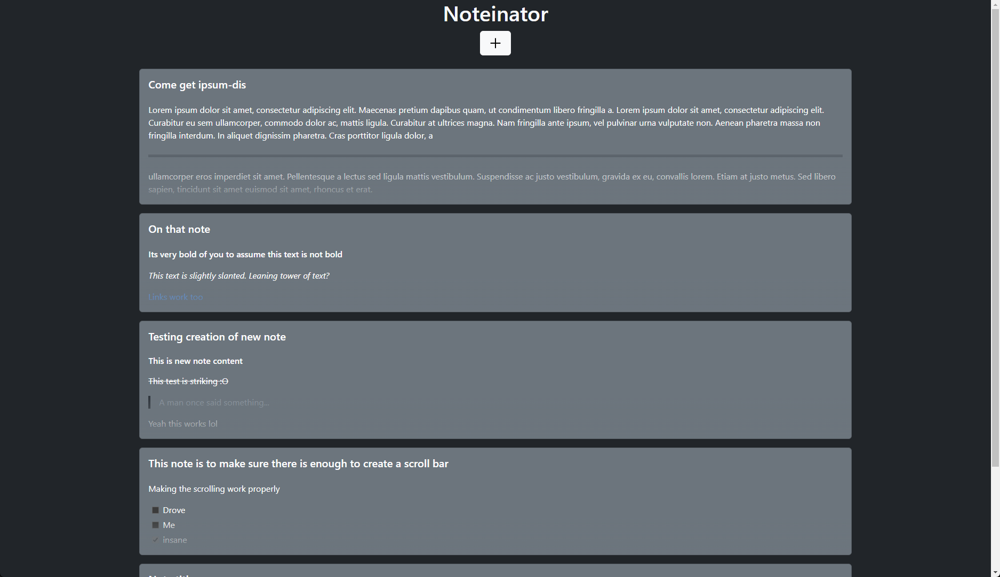

# Noteintator

Noteintator is a simple React application that allows you to creat, edit and delete notes at will.

Notes can be formatted using the built in Mardown editor and preview. 
Notes are saved locally, on-disk, using the Chromium File System Access API.

This way no internet connection is required, no personal information is transmitted on the web and your note files are always accessible wherever you choose to keep them. 
Unfortunately this also means no Firefox support.

This app was built to learn and practice the fundamentals of React.

